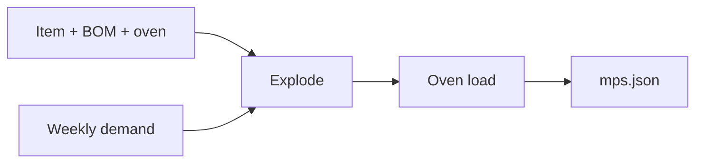

# Architecture

The public slice is a **planning loop on synthetic master data**, not a product suite.

## Why this shape

A planner has to name independent demand, explode the BOM, and see that week 38 does not fit 80 oven hours. Those facts live in JSON. Prompt text must not invent a plant.

| Module | Sample file | Role |
| --- | --- | --- |
| MDS | `samples/master/` | Item, BOM, resource calendar |
| DCP | `samples/demand/weekly.json` | Frozen independent demand |
| MPS | `src/scp_workbench/mps.py` | FG qty + dependent flour / yeast |
| ODS | same pipeline | Hours vs capacity; `breach: true` |

## What this repo is not

- Not an internal Java SCP service
- Not a customer plant or live BOM
- Not a GitLab mirror

A later slice can draw the same numbers on [pixi-gantt](https://github.com/mizuno0237/pixi-gantt).

## Interview line

*I published a tiny planning workbench — demand in, MPS plus a finite-capacity oven load out — so I can walk a hiring manager through the loop without a customer dataset.*
