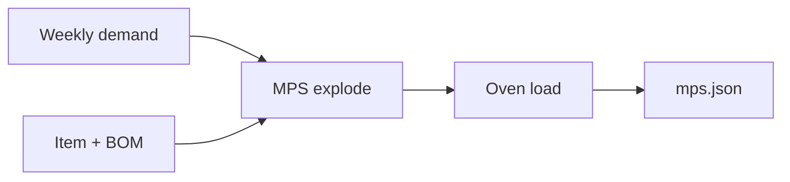

# SCP Workbench

A **public supply-chain planning demo**: synthetic master data in, a weekly MPS and oven load out. Finite capacity is visible as a breach on the peak week — not a live factory.

This is **not** a copy of an internal SCP product. Module names (MPS / MDS / DCP / ODS) match how planning suites are split; the sample plant is fictional.

[](LICENSE)

## Pipeline



| Module | What this sample does |
| --- | --- |
| **MDS** | Item, BOM, oven hours (`samples/master/`) |
| **DCP** | Frozen weekly independent demand (`samples/demand/`) |
| **MPS** | Independent FG qty + dependent flour / yeast |
| **ODS** | Oven hours vs 80 h/week; flag the breach |

Cedarline Plant 1 bakes `FG-LOAF-500`. Week 38 needs 90 oven hours against 80 — that is the demo.

## Quick start

```bash
python -m pip install pytest
python -m pytest
$env:PYTHONPATH="src"
python -m scp_workbench --out samples/output/mps.json --board samples/output/board.md --cuts samples/output/cuts.md --peg samples/output/pegging.md
```

On bash:

```bash
PYTHONPATH=src python -m scp_workbench --out samples/output/mps.json --board samples/output/board.md --cuts samples/output/cuts.md --peg samples/output/pegging.md
```

`board.md` is the supervisor view. `cuts.md` is the proposed loaf cut for week 38. `pegging.md` is flour and yeast by week. A later slice can hang the same numbers on [pixi-gantt](https://github.com/mizuno0237/pixi-gantt).

## What is not in this snapshot

- Customer plants, live BOM, or named brands
- Internal Java services
- A GitLab mirror of a product suite

Scan before every push:

```bash
python scripts/scan-secrets.py
```

GitHub About / topics: paste from [`GITHUB-ABOUT.md`](GITHUB-ABOUT.md). Longer architecture notes: [`ARCHITECTURE.md`](ARCHITECTURE.md). See [`SANITIZE.md`](SANITIZE.md).

## License

MIT
